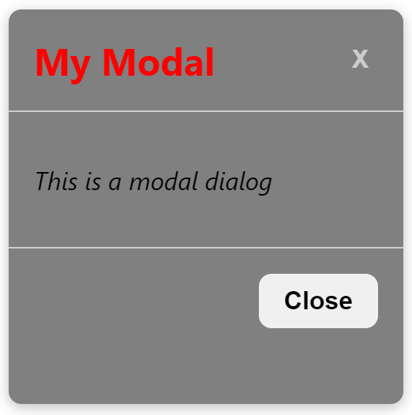

# sbm-modal

> Modal Component Library

[](https://www.npmjs.com/package/sbm-modal) [](https://standardjs.com)

## Install

```bash
npm install --save sbm-modal
```

## Usage

```jsx
import React, {useState} from 'react';
import  {Modal} from 'sbm-modal';
import 'sbm-modal/dist/index.css';

const App = () => {
  const [isOpen, setIsOpen] = useState(false);

  const openModal = () => {
    setIsOpen(true);
  };

  const closeModal = () => {
    setIsOpen(false);
  };

  return (
    <div>
      <button onClick={openModal}>Open Modal</button>
      <Modal
        title="My Modal"
        message="This is a modal dialog"
        buttonText="Close"
        isOpen={isOpen}
        titleStyle={{color: 'red'}}
        messageStyle={{fontStyle: 'italic'}}
        modalStyle={{backgroundColor: 'gray', width : '250px' }}
        onClose={closeModal}
      />
    </div>
  );
};
```
<div align="center">
  
</div>


## Props (Properties) :

| Prop Name | Type | Required | Default Value | Description |
| --- | --- | --- | --- | --- |
| title | string | Yes | - | The title of the modal |
| message | string | Yes | - | The message/body of the modal |
| buttonText | string | Yes | - | The text of the button that closes the modal |
| isOpen | boolean | Yes | - | Determines whether the modal is currently open or closed |
| onClose | function | Yes | - | A callback function to be executed when the user clicks the close button or clicks outside of the modal |
| titleStyle | object | No | {} | Additional styles to be applied to the modal title |
| messageStyle | object | No | {} | Additional styles to be applied to the modal message/body |
| buttonStyle | string | No | '' | Additional classes to be applied to the modal button |
| modalStyle | object | No | {} | Additional styles to be applied to the modal container |

## License

MIT © [saadmontreuil](https://github.com/saadmontreuil)
